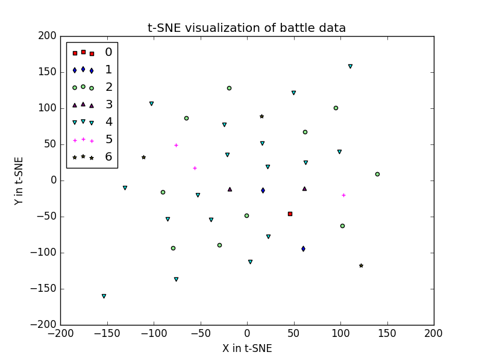

# tsne_GoT_visualization
Visualization of GoT data using t-SNE

This code attempts to visualize the GoT data from the kaggle dataset.
Link for the GoT dataset : https://www.kaggle.com/mylesoneill/game-of-thrones

### Visualization 1 :
Visualization of the battle data in different regions

Legend:
[0: 'Beyond the Wall', 1: 'The Crownlands', 2: 'The North', 3: 'The Reach', 4: 'The Riverlands', 5: 'The Stormlands', 6: 'The Westerlands']
